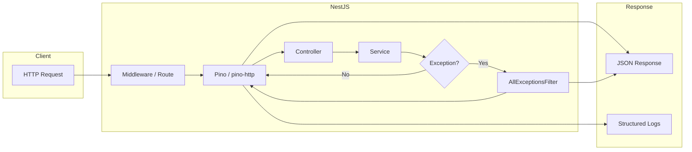
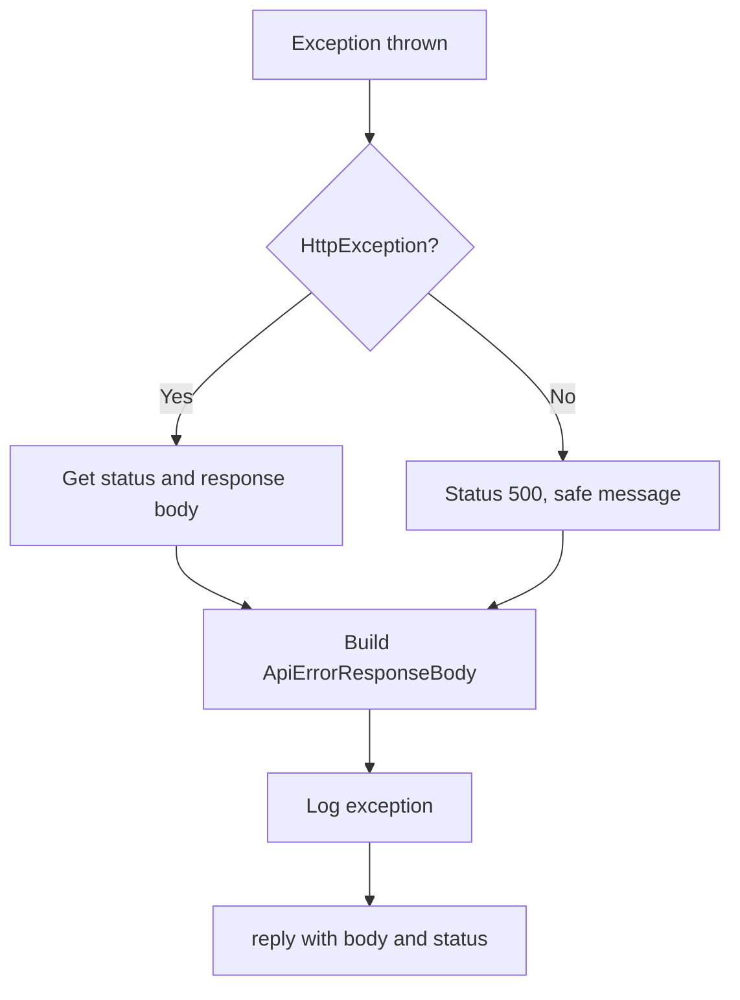

# Test Repo for Logging and Error Handling in NestJS

A NestJS application that demonstrates **structured logging** with `nestjs-pino` and **global exception handling** with a custom exception filter.

## Purpose of This Project

This repository serves as a reference implementation for:

- Configuring **Pino**-based structured logging in NestJS via the `nestjs-pino` module
- Understanding NestJS’s built-in exception layer and **global exception filters**
- Implementing a **custom exception filter** that formats all API error responses in a consistent JSON shape (status code, timestamp, path, message, optional error code)
- Writing **unit tests** for controllers, services, logger configuration, and the exception filter

It is intended for developers who want to improve observability and API consistency in NestJS backends (for example, for monitoring application health and diagnosing issues).

## Features

- **Structured logging with nestjs-pino**
  - JSON logs in production and optional pretty-printed logs in development via `pino-pretty`
  - Log level set by environment (`debug` when not in production, `info` in production)
  - Request context available to the application logger when handling HTTP requests

- **Global exception filter (`AllExceptionsFilter`)**
  - Catches every unhandled exception (HTTP and non-HTTP)
  - Sends a uniform JSON body: `statusCode`, `timestamp` (ISO 8601), `path`, `message`, and optional `errorCode`
  - Uses the HTTP adapter for responses so it works with both Express and Fastify
  - For `HttpException`, status and message are taken from the exception; for other errors, returns 500 and a safe message (exception message only in non-production)

- **Demo HTTP API**
  - `GET /` returns a welcome message and demonstrates logging
  - `GET /error` throws a generic `Error` to show filter behaviour for non-HTTP exceptions
  - `GET /http-error` throws an `HttpException` to show filter behaviour for HTTP exceptions

- **Unit tests**
  - Tests for `AppController`, `AppService`, `AppModule`, logger configuration (`pinoHttpOptions`), and `AllExceptionsFilter`
  - All tests are written in TypeScript with explicit types and Doxygen-style comments

## Dependencies

### Production Dependencies

| Package                       | Purpose                                        |
|-------------------------------|------------------------------------------------|
| `@nestjs/common`              | NestJS common utilities and decorators         |
| `@nestjs/core`                | NestJS core runtime                            |
| `@nestjs/platform-express`    | HTTP adapter for Express                       |
| `nestjs-pino`                 | Pino logger integration for NestJS             |
| `pino-http`                   | HTTP request/response logging for Pino         |
| `pino-pretty`                 | Pretty-print logs in development               |
| `reflect-metadata`            | Metadata for decorators                        |
| `rxjs`                        | Reactive extensions used by NestJS             |

### Development Dependencies

| Package                       | Purpose                            |
|-------------------------------|------------------------------------|
| `@nestjs/cli` (^11.0.16)      | NestJS CLI for build and run       |
| `@nestjs/testing`             | Testing utilities                  |
| `jest`, `ts-jest`             | Unit test runner and TS support    |
| `typescript`                  | TypeScript compiler                |
| `eslint`, `prettier`          | Linting and formatting             |

**Node.js:** v20 or later (enforced via `engines` in `package.json`).

## Summary of Code Changes

The repository was initialised as a minimal NestJS-oriented project and then extended as follows:

1. **Package and tooling configuration**
   - Added `package.json` with `engines.node >= 20`, and `@nestjs/cli` set to `^11.0.16`
   - Added `tsconfig.json` with `inlineSourceMap: true`, `inlineSources: true`, `sourceMap: false`, `removeComments: false`
   - Added `nest-cli.json` for the Nest CLI

2. **Application entry point and root module**
   - `src/main.ts`: bootstrap with `bufferLogs: true`, replace app logger with Pino `Logger`, register `AllExceptionsFilter` globally via `HttpAdapterHost`
   - `src/app.module.ts`: import `LoggerModule.forRoot({ pinoHttp: pinoHttpOptions })`, declare `AppController` and `AppService`

3. **Logger configuration**
   - `src/logger/logger.config.ts`: export `pinoHttpOptions` with environment-based level and optional `pino-pretty` transport for non-production

4. **Exception handling**
   - `src/filters/all-exceptions.filter.ts`: `@Catch()` filter that normalises all exceptions to an `ApiErrorResponseBody` and uses `httpAdapter.reply()` to send the response; includes logging of caught exceptions

5. **Controllers and services**
   - `src/app.controller.ts`: `GET /`, `GET /error`, `GET /http-error` with NestJS `Logger`
   - `src/app.service.ts`: `getHello()` with debug logging

6. **Unit tests**
   - Unit specifications for `AppController`, `AppService`, `AppModule`, `logger.config`, and `AllExceptionsFilter` (including response body shape and status codes)

All application and test code is documented with Doxygen-style comments and uses explicit TypeScript types.

## Architectural Flowcharts

### Request Flow Including Logging and Exception Handling



### Exception Filter Processing Flow



## Testing and Debugging

### Prerequisites

- Node.js v20 or later
- npm (or compatible package manager)

### Installing Dependencies

```bash
npm install
```

### Running Unit Tests

```bash
npm test
```

To run tests in watch mode:

```bash
npm run test:watch
```

To generate a coverage report:

```bash
npm run test:cov
```

### Building and Running the Application

```bash
npm run build
npm run start
```

For development with file watching:

```bash
npm run start:dev
```

The server listens on the port given by the `PORT` environment variable, or 3000 by default.

### Manual Verification of API Endpoints

After starting the server:

- **Successful request:** `curl http://localhost:3000/` should return the welcome message and produce logs.
- **Generic exception:** `curl http://localhost:3000/error` should return HTTP 500 with a JSON body containing `statusCode`, `timestamp`, `path`, and `message`.
- **HTTP exception:** `curl http://localhost:3000/http-error` should return HTTP 400 with a JSON body including the custom message and the same standard fields.

### Debugging Procedures

- Use **debug mode** for the application: `npm run start:debug`, then attach a Node.js debugger (e.g. in VS Code or Chrome DevTools).
- Use **debug mode** for tests: `npm run test:debug` to run Jest with the inspector so that breakpoints may be set in specification files.
- Logs are structured (JSON in production); in development they are pretty-printed by `pino-pretty` for easier reading. The global exception filter logs every caught exception at error level with context.

### Code Linting

```bash
npm run lint
```

To format the code with Prettier:

```bash
npm run format
```
